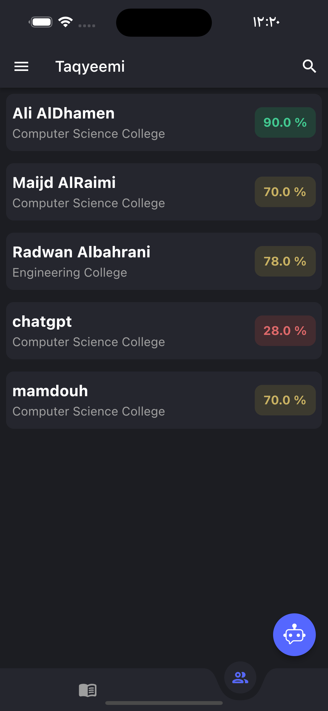
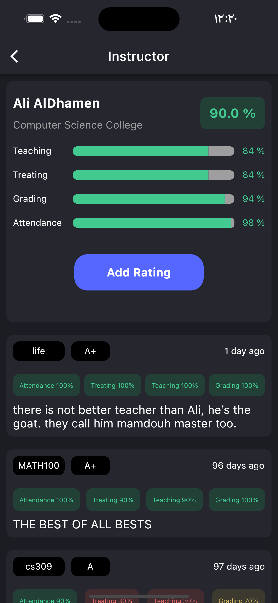
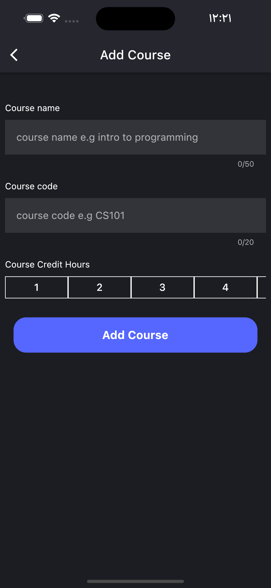
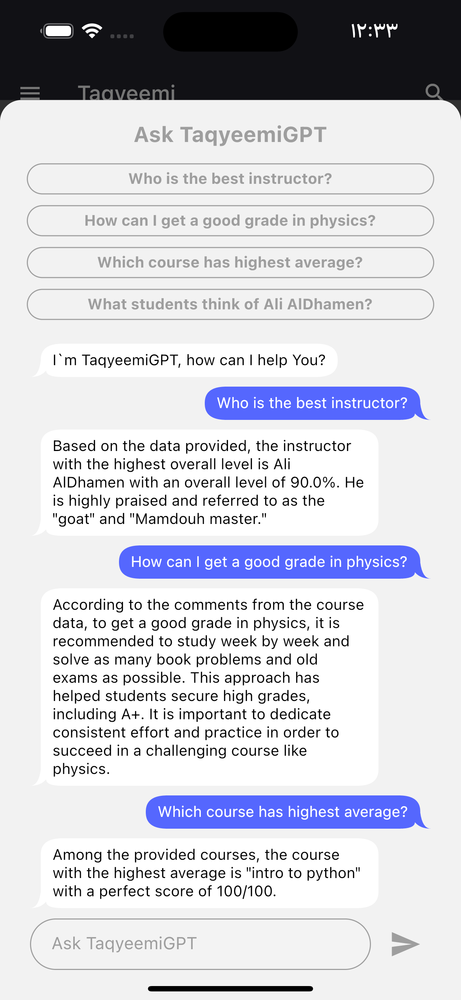

# Taqyeemi
Taqyeemi is a student-centric app developed using Flutter and Firebase, designed to empower users to rate college courses, evaluate instructors, and provide valuable feedback for future students. This app aims to enhance your learning journey by offering access to a wealth of educational resources.

## Features

- **Course Ratings and Comments**: Taqyeemi allows users to view ratings and comments for all college courses, helping them make informed decisions about their academic pursuits.

- **Instructor Ratings and Comments**: Users can also access ratings and comments for all instructors, giving them insights into the teaching quality and approach.

- **Searching**: Taqyeemi features a search functionality, enabling users to find specific courses or instructors effortlessly.

- **Adding Missing Courses/Instructors**: The app allows users to contribute by adding missing courses or instructors, fostering a collaborative community for knowledge sharing.
  
- **TaqyeemiGPT Integration**: One of the unique features of Taqyeemi is the integration of TaqyeemiGPT, an AI-powered virtual assistant that can answer any questions related to instructors and courses. Users can seek instant guidance and information using this powerful feature.

### Restaurant Interface

  
  
  
  

## Installation

To run Taqyeemi on your device, follow these steps:

1. Clone this repository to your local machine.

2. Install Flutter on your computer.
 
3. Run the app on your preferred emulator or physical device using Flutter's development tools.

## APK FILE FOR ANDROID

[https://drive.google.com/file/d/1KNI9BNI5_YtGT5A7eFgmsJTzgLt7Be8E/view?usp=drive_link](https://drive.google.com/file/d/1sXU2VjXg39YqslczFGcmoEs4nLwe2mQk/view?usp=drive_link)

Thank you for choosing Taqyeemi to enhance your learning journey! We hope you find the app valuable and enjoy using it. Happy learning! 📚🚀
